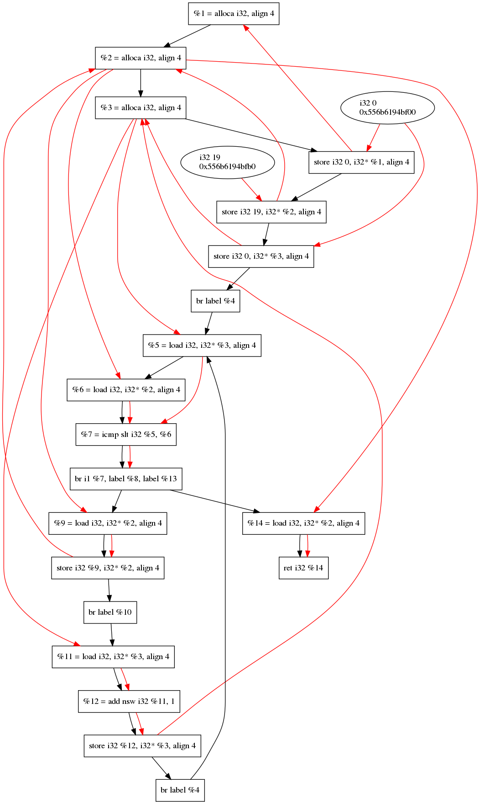

# LLVM-CFG-DFG-pass
Simple passes for CFG and DFG analysis

## quick start
We have already bulid the file, so you cna use it directly as long as the following requirements are satisified:
+ you pc has already installed llvm & clang
+ graphviz installed on your pc (use ***sudo apt-get install graphviz graphviz-doc*** if you do not possess one)

### 1. build the project
```bash
	cd CFGPass/build
	cmake ..
	make
	
	cd DFGPass/build
	cmake ..
	make
```
### 2. run the test case
use the bash command to test our passes
```bash
	sh testDFGPass.sh
	sh testCFGPass.sh
```
the result is based on the c code: ***test.c***

<div align="center"></div>
<div align="center">fig1: CFG for test.c</div>

<br>
<br>
<br>
<div align="center"></div>
<div align="center">fig1: DFG for test.c</di>

**Note: each argument has been marked with different kinds of color. So the life span of each argument can be visible in this graph.**
